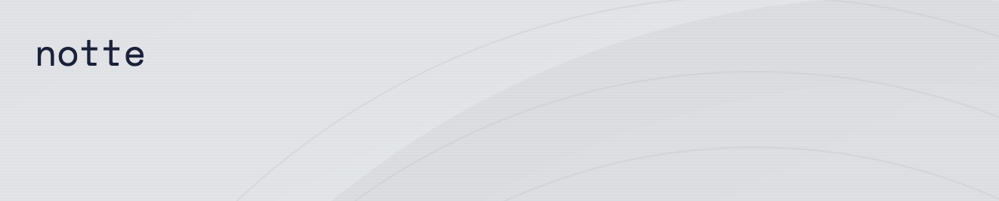

# Rapidly build reliable and fast web agents

<div align="center">
  <p>
    We outperform all other web agents in <strong>speed</strong>, <strong>costs</strong>, and <strong>reliability</strong> <br/>
    → 🔥 <a href="https://github.com/nottelabs/open-operator-evals" target="_blank" rel="noopener noreferrer">Read more on open-operator-evals</a> • <a href="https://x.com/nottecore?ref=github" target="_blank" rel="noopener noreferrer">X</a> • <a href="https://www.linkedin.com/company/nottelabsinc/?ref=github" target="_blank" rel="noopener noreferrer">LinkedIn</a> • <a href="https://notte.cc?ref=github" target="_blank" rel="noopener noreferrer">Landing</a> • <a href="https://console.notte.cc/?ref=github" target="_blank" rel="noopener noreferrer">Console</a>
  </p>
</div>

<p align="center">
  
</p>

[](https://github.com/nottelabs/notte/stargazers)
[](https://spdx.org/licenses/SSPL-1.0.html)
[](https://www.python.org/downloads/)
[](https://pypi.org/project/notte/)
[](https://pepy.tech/projects/notte)
[](https://github.com/nottelabs/notte/commits/main)

[](https://replit.com/@andreakiro/notte-python-agent-starter)
<a href="https://www.producthunt.com/products/notte" target="_blank"></a>

---

## What is Notte?

Notte provides the full-stack web AI agents framework that allows you to develop, deploy, and scale your own agents, all with a single API. Transform the internet into an agent-friendly environment and websites into structured, navigable maps described in natural language. Read more on our documentation [here](https://docs.notte.cc) 🔥

### Key Features

- **[Browser Sessions](https://docs.notte.cc/side/fullstack/sessions)** → on-demand headless browser instances, built in & custom proxy config, CDP, cookie integration, session replay
- **[Run automated LLM-powered agents](https://docs.notte.cc/side/fullstack/agents)** → solve complex tasks on the web
- **[Page interactions](https://docs.notte.cc/side/fullstack/page_interactions)** → observe website states and execute actions using intuitive natural language commands — granular control while maintaining the simplicity of natural language interaction
- **[Secrets Vault](https://docs.notte.cc/side/fullstack/vault)** → enterprise-grade credential management for your Sessions & Agents

### 🚀 Zero Friction Agentic Browsing

```
notte.Agent(session).run(task="go to twitter and post: new era this is @nottecore taking over my acc")
```

<p align="center">
  
</p>

Fast, reliable, agentic browsing (speed x2):

- secure password vault
- bypass bot detection

---

## Benchmarks

| Rank | Provider                                                    | Agent Self-Report | LLM Evaluation | Time per Task | Task Reliability |
| ---- | ----------------------------------------------------------- | ----------------- | -------------- | ------------- | ---------------- |
| 🏆   | [Notte](https://github.com/nottelabs/notte)                 | **86.2%**         | **79.0%**      | **47s**       | **96.6%**        |
| 2️⃣   | [Browser-Use](https://github.com/browser-use/browser-use)   | 77.3%             | 60.2%          | 113s          | 83.3%            |
| 3️⃣   | [Convergence](https://github.com/convergence-ai/proxy-lite) | 38.4%             | 31.4%          | 83s           | 50%              |

Read the full story here: [https://github.com/nottelabs/open-operator-evals](https://github.com/nottelabs/open-operator-evals)

---

## ⚡️ Quickstart me

We provide an easy to use API with our hosted version.

To run the above you'll need to sign up on the [notte console](https://console.notte.cc) and create a free notte API key 🔑

```bash
uv venv --python 3.11
source .venv/bin/activate
uv pip install notte-sdk
```

...and spin up your crazy cool and dead simple agent on our remote machine:

```python
import os
from notte_sdk import NotteClient

notte = NotteClient(api_key=os.getenv("NOTTE_API_KEY"))

with notte.Session(headless=False) as session:
    agi = notte.Agent(reasoning_model="gemini/gemini-2.0-flash", max_steps=5, session=session)
    agi.run(task="doom scroll cat memes on google images")
```

This is by far the closest attempt to AGI we've ever witnessed ;)


> To run locally, refer to guide [here](#how-to-run-notte-locally).

---

## 🔥 Build Powerful Web Agents

Notte is composed of 3 main components that can be combined to build your own agentic system: `notte.Session`, `notte.Vault` and `notte.Agent`.

You can use the `notte.Session` to create a browser session with different stealth configurations (i.e browser types, proxies, captcha, etc), the `notte.Vault` to store your credentials and the `notte.Agent` to run your agent.

Here is an example of how to use these components together along with structured output:

```python
from notte_sdk import NotteClient
from pydantic import BaseModel

class TwitterPost(BaseModel):
    url: str

notte = NotteClient()
with notte.Vault() as vault, notte.Session(headless=False, proxies=False, browser_type="chrome") as session:
    vault.add_credentials(
        url="https://x.com",
        username="your-email",
        password="your-password",
    )
    agent = notte.Agent(session=session, vault=vault, max_steps=10)
    response = agent.run(
      task="go to twitter and post: new era this is @nottecore taking over my acc. Return the post url.",
      response_format=TwitterPost,
    )
print(response.answer)
```


---

## ✨ Highlights

Our main tech highlight is that we introduce a perception layer that turns the internet into an agent-friendly environment, by turning websites into structured maps described in natural language, ready to be digested by an LLM with less effort.

```python
from notte_sdk import NotteClient

notte = NotteClient()
with notte.Session(headless=False) as page:
    obs = page.observe(url="https://www.google.com/travel/flights")
    print(obs.space.markdown)
```

```
# Flight Search
* I1: Enters departure location (departureLocation: str = "San Francisco")
* I3: Selects departure date (departureDate: date)
* I6: Selects trip type (tripType: str = "round-trip", allowed=["round-trip", "one-way", "multi-city"])
* B3: Search flights options with current filters

# Website Navigation
* B5: Opens Google apps menu
* L28: Navigates to Google homepage

# User Preferences
* B26: Open menu to change language settings
...
```

The above gives you the gist of how we push to better parse webpages and reduce the cognitive load of LLM reasoners. The aim is to enable you to build and deploy more accurate web browsing agents, while downgrading to smaller models, which in turn increase inference speed and reduce production costs.

### ☄️ Speed contest vs. Browser-Use

The perception layer enables smaller models (e.g. the llama suite) to be connected for the agent's reasoning, because all the DOM noise is abstracted and the LLM can focus on a set of actions described in plain language. This allows the agent to be served on ultra-high inference such as Cerebras without losing precision:

```python
from notte_sdk import NotteClient

notte = NotteClient()
with notte.Session(headless=False) as session:
    agent = notte.Agent(reasoning_model="gemini/gemini-2.0-flash", max_steps=5, session=session)
    agent.run(task="search cheapest flight from paris to nyc on gflight")
```

> left:browser-use, right:notte-agent (cerebras)

<p align="center">
  
</p>

## 🌐 The Full Stack Framework

Notte's full stack agentic internet framework combines core browser infrastructure (sessions, live replay, cdp) with intelligent browsing agents, bridged and enhanced with our perception layer. Our entire codebase is made to be highly customizable, ready to integrate other devtools from the ecosystem and packaged to be push to prod. We also provide web scripting capabilities and sota scraping endpoints out of the box, because why not.

<table>
  <tr>
    <th><strong>service</strong></th>
    <th><code>agent.run()</code></th>
    <th><code>agent.cloud()</code></th>
    <th><code>page.scrape()</code></th>
    <th><code>page.step()</code></th>
    <th><code>page.perceive()</code></th>
  </tr>
  <tr>
    <td><strong>browser-use</strong></td>
    <td align="center">🌕</td>
    <td align="center">🌕</td>
    <td></td>
    <td></td>
    <td></td>
  </tr>
  <tr>
    <td><strong>stagehand</strong></td>
    <td></td>
    <td></td>
    <td align="center">🌕</td>
    <td align="center">🌕</td>
    <td></td>
  </tr>
  <tr>
    <td><strong>notte</strong></td>
    <td align="center">🌕</td>
    <td align="center">🌕</td>
    <td align="center">🌕</td>
    <td align="center">🌕</td>
    <td align="center">🌕</td>
  </tr>
</table>

PS: The title of services are figurative eg. `agent.cloud()` refers to hosting an agent in cloud for you.

### Unstable and upcoming features

⏭️ We have either already partially shipped or are working on the following features: captcha resolution, residential proxies, web security, vpn-style browsing, authentication and payments with secure safe, improved speed and memory, human-in-the-loop integration, channeled notifications, and cookies management.


## Notte Console

You use our [console]((https://console.notte.cc) to manage your agents and sessions, create API keys and monitor your usage.

Most of our open-source features are also available on the cloud-hosted version with a large free-tier!

Example for webpage scraping & structured schema llm extraction

```python
from notte_sdk import NotteClient

notte = NotteClient()
data = notte.scrape(url="https://pump.fun", instructions="get top 5 latest trendy coins on pf, return ticker, name, mcap")
```

<p align="center">
  
</p>


## How to run notte locally ?

You will need to provide your own LLM provider API key, and install the dependencies:

```bash
uv venv --python 3.11
source .venv/bin/activate
uv pip install notte
uv run patchright install --with-deps chromium
export GEMINI_API_KEY="your-api-key"
```

...and spin up your crazy cool and dead simple agent on your local machine:

```python
import notte

with notte.Session(headless=False) as session:
    agi = notte.Agent(reasoning_model="gemini/gemini-2.0-flash", max_steps=5, session=session)
    agi.run(task="doom scroll cat memes on google images")
```


## Contribute

Setup your local working environment;

```bash
uv sync --all-extras --dev
uv run patchright install --with-deps chromium
uv run pre-commit install
```

Find an issue, fork, open a PR, and merge :)

## License

This project is licensed under the Server Side Public License v1.
See the [LICENSE](LICENSE) file for details.

## Citation

If you use notte in your research or project, please cite:

```bibtex
@software{notte2025,
  author = {Pinto, Andrea and Giordano, Lucas and {nottelabs-team}},
  title = {Notte: Software suite for internet-native agentic systems},
  url = {https://github.com/nottelabs/notte},
  year = {2025},
  publisher = {GitHub},
  license = {SSPL-1.0}
  version = {1.4.4},
}
```

Built with luv from Earth 🌏

---

Copyright © 2025 Notte Labs, Inc.
